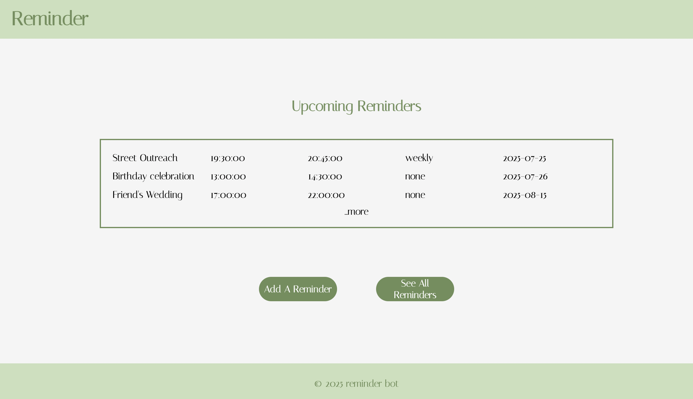
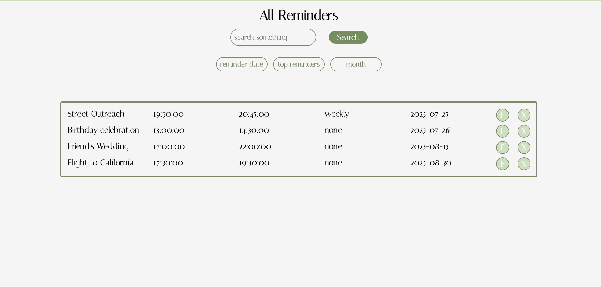
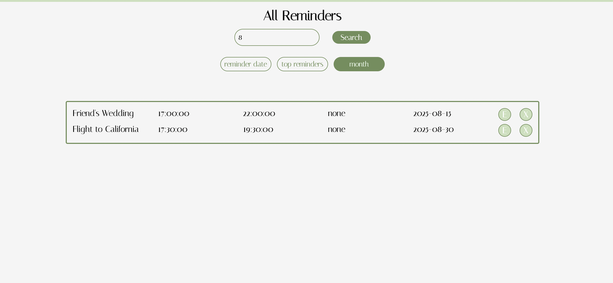

# ⏰ Reminder App

**Reminder App** is a full‑stack reminder management application where users can create, view, update, and delete reminders through a clean, responsive interface.

This project originally started as a backend‑only application, using a scheduler to send daily reminders through a Discord bot and weekly notifications via email. Over time, I expanded it into a full‑stack project by adding a **frontend interface built with React** to make managing reminders easier and more user‑friendly.

Built with **React**, **Node.js**, **Express.js**, and **PostgreSQL**, and deployed with **Vercel** (frontend) and **Railway** (backend & database).

👉 **Try it here:** [Reminder App](https://reminder-bot-sigma.vercel.app)

---

### 📸 Selected Screens

**Home Page** `/`  
  
On the home page, the upcoming three reminders are displayed. To see the full list, click **“See All Reminders.”** To add a new reminder, click **“Add A Reminder.”**

---

**Add a Reminder** `/add-reminder`  
   
When creating a reminder, you can set the frequency — is it a one‑time reminder or recurring?  
If recurring, choose how often (weekly, monthly, etc.).

---

**View All Reminders** `/view-all`  
   
View all upcoming reminders at once, or use filters to search by:  
- Reminder date (e.g., `2025‑07‑25`)  
- Top number of reminders (e.g., top 3 reminders)  
- Month (e.g., `8` for August)  

You can also edit or delete reminders using the buttons on the right.

---

### 🔧 Future Improvements

- Currently, the app does not require authentication and cannot be used by multiple users. I’d like to scale it up so people can create accounts and manage reminders specific to their needs.  
- Add a feature that lets users review a complete history of past reminders.  
- Add a feature that lets users categorize reminders (e.g., leisure, productivity) and mark their importance level.
