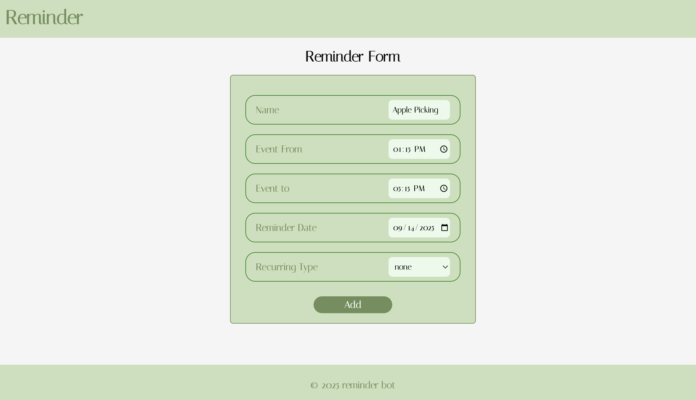
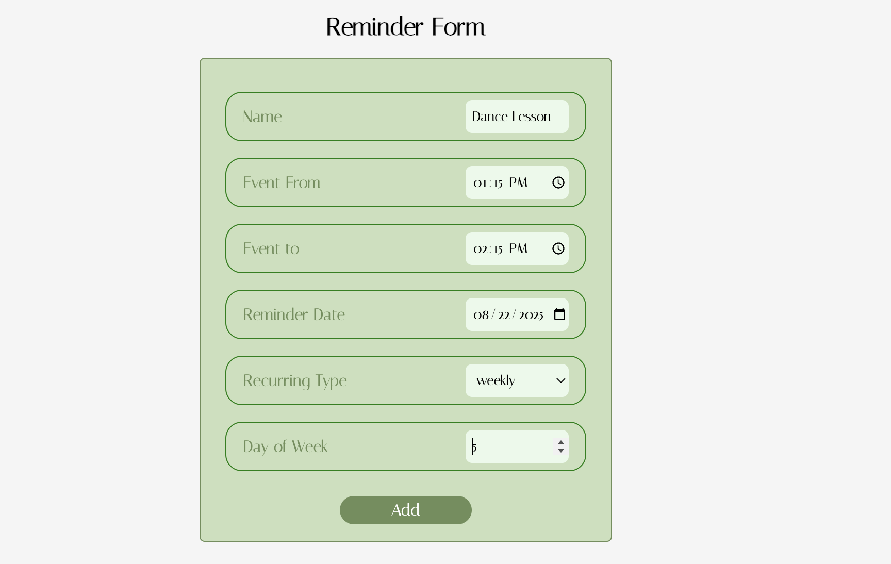

# ⏰ Reminder App

**Reminder App** is a full‑stack reminder management application where users can create, view, update, and delete reminders through a clean, responsive interface.

This project originally started as a backend‑only application, using a scheduler to send daily reminders through a Discord bot and weekly notifications via email. Over time, I decided to make it a full‑stack project by adding a **frontend interface built with React** to easily manage reminders.

Built with **React**, **Node.js**, **Express.js**, and **PostgreSQL**, deployed with **Vercel** (frontend) and **Railway** (backend & database).

You can add some reminders here: [Reminder App](https://reminder-bot-sigma.vercel.app)

### Selected Screens 
* Home page /
[Reminder App homepage](./src/assets/screenshot1.png)
On the home page, it shows the upcoming 3 reminders. To see the full list of reminders, I can click on the "See All Reminders" button. If I need to add a reminder, I'd click on the "Add A Reminder" button.

* Add a reminder /add-reminder
 
When creating details for the reminder, you can also set the frequency - is it a one-time reminder? Is it recurring?
If it is recurring, how often is it? weekly? monthly?

